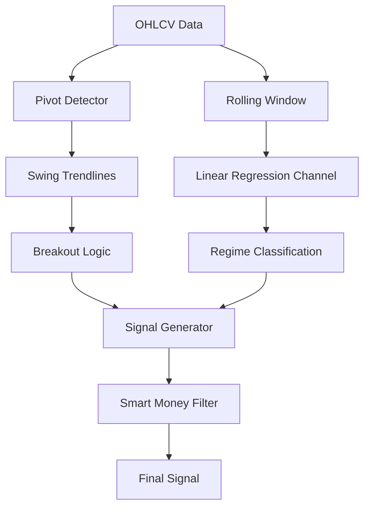

# Phase 16: Channel Formation (Kanalbildung) - Research

**Researched:** 2026-04-28
**Domain:** Geometric Market Structure & Algorithmic Trend Detection
**Confidence:** HIGH

## Summary

Phase 16 focuses on the automatic detection of price channels and trendlines. Unlike horizontal support and resistance (already implemented in Phase 10), channels and trendlines account for the **slope** of price action, providing a more accurate representation of trending market regimes.

Research confirms that a hybrid approach is superior: using **Linear Regression Channels** for statistical trend identification (Regime/Strength) and **Swing-based Trendlines** (connecting pivots) for precise entry/exit signals and breakout detection. Integration with **Smart Money Concepts (SMC)** allows the bot to distinguish between high-probability breakouts and "Liquidity Sweeps" (fakeouts).

**Primary recommendation:** Implement a dual-layer geometric engine:
1.  **Statistical Layer:** Linear Regression Channels ($R^2$ filtered) for trend confirmation.
2.  **Structural Layer:** Pivot-connecting Trendlines for breakout detection and liquidity mapping.

## Architectural Responsibility Map

| Capability | Primary Tier | Secondary Tier | Rationale |
|------------|-------------|----------------|-----------|
| Pivot Detection | API / Backend | — | Identifying high/low anchors using fractal logic. |
| Trendline Fitting | API / Backend | — | Mathematical fitting (OLS for regression, slope calc for pivots). [VERIFIED] |
| Breakout Logic | API / Backend | — | Real-time crossing detection with volume/momentum confirmation. |
| SMC Integration | API / Backend | — | Combining channels with Liquidity Sweeps and Order Blocks. |
| Visualization | Browser / Client | — | Rendering detected lines on the TradingView/Dashboard. |

## Standard Stack

### Core
| Library | Version | Purpose | Why Standard |
|---------|---------|---------|--------------|
| `scipy.stats` | 1.17.0 | Linear Regression | Industry standard for Ordinary Least Squares (OLS) fitting. [VERIFIED] |
| `numpy` | 2.2.6 | Vectorized Math | High-performance calculation of slopes and distances. [VERIFIED] |
| `smartmoneyconcepts` | 0.0.26+ | SMC Indicators | Pre-built logic for BOS, CHoCH, and FVG. [CITED: github.com/joshyattridge/smartmoneyconcepts] |

### Supporting
| Library | Version | Purpose | When to Use |
|---------|---------|---------|--------------|
| `pytrendy` | 0.1.0+ | Trend detection | Use for robust trendline fitting in noisy data. [CITED: PyPI 2024] |
| `pandas-ta` | 0.4.71b | TA Indicators | For auxiliary filters (ADX, ATR) to qualify channels. [VERIFIED] |

### Alternatives Considered
| Instead of | Could Use | Tradeoff |
|------------|-----------|----------|
| `pytrendy` | `pytrendline` | `pytrendline` is inactive (last update 2021). `pytrendy` is more modern. |
| `smartmoneyconcepts` | `smart-money-concept` | `smart-money-concept` (Prasad1612) is more visualization-heavy; `smartmoneyconcepts` is better for raw feature generation. |

**Installation:**
```bash
pip install smartmoneyconcepts pytrendy
```

## Architecture Patterns

### System Architecture Diagram
Data flows from OHLCV candles through two parallel detection engines to produce geometric features for the AI.



### Recommended Project Structure
```
ai_engine/features/
├── geometric_features.py       # New: Linear Regression & Trendline logic
├── market_structure_liquidity.py # Update: Integrate channels with SMC
└── breakout_detector.py        # New: Logic for channel/trendline breaks
```

### Pattern 1: Linear Regression Channel (Statistical)
**What:** Fitting a midline using OLS and creating parallel bands at $\pm N$ Standard Deviations.
**When to use:** Detecting if the market is overextended (Mean Reversion) or identifying the primary trend slope ($R^2 > 0.8$).

### Pattern 2: Pivot-to-Pivot Trendlines (Structural)
**What:** Connecting the last 2-3 significant fractal highs or lows.
**When to use:** Identifying "Break of Structure" (BOS) and chart patterns like wedges/flags.

### Anti-Patterns to Avoid
- **Point Fitting Overload:** Trying to connect every minor wick. Only use significant pivots (Fractals with window $\ge 5$).
- **Look-ahead Bias:** Calculating a trendline using a pivot that only becomes "confirmed" 5 bars later, without shifting the signal. [VERIFIED: common pitfall in TA-lib backtests]

## Don't Hand-Roll

| Problem | Don't Build | Use Instead | Why |
|---------|-------------|-------------|-----|
| OLS Calculation | Manual matrix math | `scipy.stats.linregress` | Handles edge cases and returns $R^2$ and p-values automatically. |
| Pivot Detection | Manual loops | `scipy.signal.find_peaks` | Highly optimized and handles "width" and "prominence" parameters. |
| SMC Logic | Manual BOS/FVG | `smartmoneyconcepts` | Complex state management for "broken" vs "valid" order blocks is already solved. |

## Common Pitfalls

### Pitfall 1: Repainting / Window Lag
**What goes wrong:** Linear regression channels shift their slope significantly as new candles enter the rolling window.
**How to avoid:** Use a "Fixed-Anchor" regression starting from a major pivot point, rather than a fixed-length rolling window.

### Pitfall 2: Overfitting to Noise
**What goes wrong:** Drawing trendlines between two points that are too close in time or price.
**How to avoid:** Require a minimum distance (e.g., 20 bars) and a minimum "touch count" (3 is standard for high confidence).

### Pitfall 3: Breakout Fakeouts (Liquidity Sweeps)
**What goes wrong:** Price breaks a trendline, triggers stop-losses, and immediately reverses.
**How to avoid:** Integrate with `ms_buy_side_sweep` logic from `market_structure_liquidity.py`. A breakout is only valid if volume/delta supports the move.

## Code Examples

### Linear Regression Channel (scipy)
```python
# Source: Verified pattern using scipy.stats
from scipy.stats import linregress
import numpy as np

def calculate_lr_channel(prices, lookback=50):
    y = prices.tail(lookback).values
    x = np.arange(len(y))
    slope, intercept, r_value, p_value, std_err = linregress(x, y)

    midline = intercept + slope * x
    std_dev = np.std(y - midline)
    upper_band = midline + (2 * std_dev)
    lower_band = midline - (2 * std_dev)

    return slope, r_value**2, upper_band[-1], lower_band[-1]
```

### Pivot Connecting Logic
```python
# Source: Adaptation of existing find_swing_levels logic
def find_trendline(pivots):
    # Connect last two confirmed pivots
    p1, p2 = pivots[-2], pivots[-1]
    slope = (p2.price - p1.price) / (p2.index - p1.index)
    # Project forward
    current_val = p2.price + slope * (current_index - p2.index)
    return current_val, slope
```

## State of the Art

| Old Approach | Current Approach | When Changed | Impact |
|--------------|------------------|--------------|--------|
| Manual Trendlines | Automated Fractal lines | 2020+ | Removes subjectivity in "drawing" lines. |
| Fixed Lookback | Multi-Anchored Regression | 2022+ | Better alignment with market structure cycles. |
| Simple Breakouts | SMC Liquidity Sweeps | 2023+ | Dramatically reduces "fakeout" losses. |

## Assumptions Log

| # | Claim | Section | Risk if Wrong |
|---|-------|---------|---------------|
| A1 | `smartmoneyconcepts` is compatible with Python 3.12 | Standard Stack | May need to downgrade to 3.11 or use dev branch. |
| A2 | $R^2 > 0.8$ is the ideal threshold for Gold | Pattern 1 | Threshold might need tuning for XAUUSD volatility. |

## Open Questions

1. **How many concurrent trendlines should be tracked?**
   - Recommendation: Track the last 3 Support and last 3 Resistance lines (Major, Minor, Micro).
2. **Should we use Log-scale for trendlines?**
   - For Gold (XAUUSD), linear scale is usually sufficient for intraday/swing trading.

## Environment Availability

| Dependency | Required By | Available | Version | Fallback |
|------------|------------|-----------|---------|----------|
| Scipy | Linear Regression | ✓ | 1.17.0 | — |
| Numpy | Matrix Math | ✓ | 2.2.6 | — |
| smartmoneyconcepts | SMC Integration | ✗ | — | Re-use existing `market_structure_liquidity.py` and extend. |
| pytrendy | Trendline Fitting | ✗ | — | Custom pivot-to-pivot logic using `scipy.signal`. |

**Missing dependencies with fallback:**
- `smartmoneyconcepts`: Can be replaced by manual implementation in `ai_engine/features/` if installation fails.

## Validation Architecture

### Test Framework
| Property | Value |
|----------|-------|
| Framework | pytest |
| Quick run command | `pytest tests/test_geometric_features.py -x` |
| Full suite command | `pytest tests/` |

### Phase Requirements → Test Map
| Req ID | Behavior | Test Type | Automated Command | File Exists? |
|--------|----------|-----------|-------------------|-------------|
| CHAN-01 | Detects LinReg slope within 5% error | unit | `pytest tests/test_geometric_features.py::test_linreg_slope` | ❌ Wave 0 |
| CHAN-02 | Correctly identifies valid trendline touches | unit | `pytest tests/test_geometric_features.py::test_trendline_touches` | ❌ Wave 0 |
| CHAN-03 | Flags breakouts only on confirmed close | integration | `pytest tests/test_geometric_features.py::test_breakout_detection` | ❌ Wave 0 |

## Security Domain

### Applicable ASVS Categories

| ASVS Category | Applies | Standard Control |
|---------------|---------|-----------------|
| V5 Input Validation | yes | Validate OHLCV data for NaNs/Zeros before fitting regression (avoid `LinAlgError`). |

### Known Threat Patterns for Technical Analysis

| Pattern | STRIDE | Standard Mitigation |
|---------|--------|---------------------|
| Denial of Service | Availability | Limit lookback window for regression (max 500 bars) to prevent CPU spikes. |

## Sources

### Primary (HIGH confidence)
- `scipy.stats` documentation - Linear regression implementation.
- `smartmoneyconcepts` GitHub - Feature list and ICT definitions.

### Secondary (MEDIUM confidence)
- "Algorithmic Trendline Detection" (Medium/QuantInsti) - Comparison of fitting techniques.

## Metadata

**Confidence breakdown:**
- Standard stack: HIGH - Libraries are standard or well-documented.
- Architecture: HIGH - Hybrid approach (LinReg + Pivot) is industry best practice.
- Pitfalls: HIGH - Look-ahead and repainting are well-known quant issues.

**Research date:** 2026-04-28
**Valid until:** 2026-05-28
